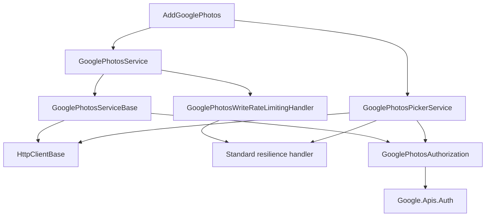

# CasCap.Api.GooglePhotos

[](https://nuget.org/packages/CasCap.Api.GooglePhotos)

## Purpose

An unofficial .NET client library for the Google Photos Library API and Picker API. It wraps the REST endpoints behind strongly-typed models, reuses the official `Google.Apis.Auth` OAuth flow, and adds paging, batching, streaming uploads, resilience and optional client-side write rate limiting.

Since Google's March 2025 API change the Library API only manages albums and media items created by your own application. Use the Picker API when the user must choose existing photos and videos.

## Installation

```powershell
dotnet package add CasCap.Api.GooglePhotos
```

## Services

| Type | Purpose |
| --- | --- |
| `GooglePhotosService` | Library API client: albums, enrichments, media item search, uploads and downloads for application-created content |
| `GooglePhotosPickerService` | Picker API client: picking sessions, selected media listing and authenticated media streaming |
| `GooglePhotosOptions` | Endpoints, OAuth credentials, scopes, timeouts and write rate-limit configuration |
| `GooglePhotosException` | Wraps errors returned by either API |

## Extensions

`AddGooglePhotos` registers both clients, their `HttpClient` configuration, the standard resilience pipeline and the optional write rate limiter.

```csharp
var builder = Host.CreateApplicationBuilder(args);

builder.Services.AddGooglePhotos(builder.Configuration);

await builder.Build().RunAsync();
```

Overloads accept an `IConfiguration` section, a `GooglePhotosOptions` instance, or an `Action<GooglePhotosOptions>` delegate. All three validate the resulting options.

## Configuration

Options bind from the `CasCap:GooglePhotosOptions` configuration section. Environment variables use the standard double-underscore form, for example `CasCap__GooglePhotosOptions__ClientId`.

Minimal configuration:

```json
{
  "CasCap": {
    "GooglePhotosOptions": {
      "User": null,
      "Scopes": [ "AppendOnly" ],
      "ClientId": null,
      "ClientSecret": null
    }
  }
}
```

Complete configuration:

```json
{
  "CasCap": {
    "GooglePhotosOptions": {
      "BaseAddress": "https://photoslibrary.googleapis.com/v1/",
      "PickerBaseAddress": "https://photospicker.googleapis.com/v1/",
      "User": null,
      "Scopes": [
        "AppendOnly",
        "ReadOnlyAppCreatedData",
        "EditAppCreatedData",
        "PickerMediaItemsReadOnly"
      ],
      "FileDataStoreFullPathOverride": null,
      "RequestTimeoutSeconds": 90,
      "UploadTimeoutSeconds": 3600,
      "WriteRateLimit": {
        "Enabled": false,
        "PermitLimit": 8,
        "QueueLimit": 100,
        "SegmentsPerWindow": 6,
        "WindowSeconds": 60
      },
      "ClientId": null,
      "ClientSecret": null
    }
  }
}
```

| Key | Purpose |
| --- | --- |
| `BaseAddress` | Library API endpoint |
| `PickerBaseAddress` | Picker API endpoint |
| `User` | Local token-cache key, not necessarily the Google account email address |
| `Scopes` | OAuth scopes to request; request only what the application needs |
| `ClientId`, `ClientSecret` | Desktop app OAuth client credentials |
| `FileDataStoreFullPathOverride` | Optional directory for the cached OAuth grant |
| `RequestTimeoutSeconds` | Timeout for a single non-upload API request |
| `UploadTimeoutSeconds` | Timeout for a single media upload request |
| `WriteRateLimit` | Optional client-side sliding-window limiter for mutating Library API requests |

`ClientId`, `ClientSecret` and `User` are sensitive. Store them in .NET User Secrets locally and in environment variables or a secret-backed configuration provider elsewhere. Never commit them, and never place them in a file that is packaged into an application.

## Service Architecture



## Dependencies

| Package | Purpose |
| --- | --- |
| `Google.Apis.Auth` | OAuth authentication and cached token grants |
| `Microsoft.AspNetCore.WebUtilities` | Query-string construction |
| `Microsoft.Extensions.Http.Resilience` | HTTP timeouts, circuit breaking and safe retries |
| `Microsoft.Extensions.Options.ConfigurationExtensions` | Options binding |
| `Microsoft.Extensions.Options.DataAnnotations` | Options validation |
| `MimeTypeMapOfficial` | Upload MIME-type detection |
| `System.Threading.RateLimiting` | Optional temporal Library API write limiting |
| `CasCap.Common.Net` | Shared HTTP and serialization infrastructure |

## Documentation

Full usage guidance, Google Cloud setup and Picker API walkthrough live in the [repository README](https://github.com/f2calv/CasCap.Api.GooglePhotos).
